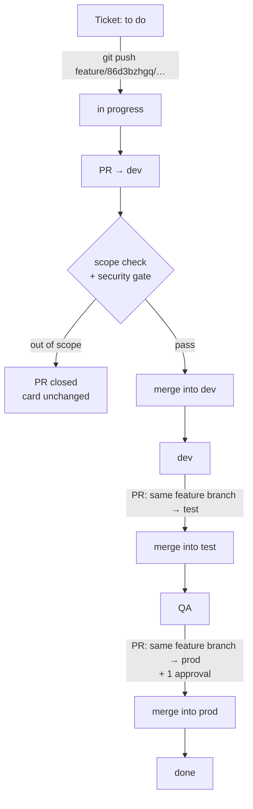
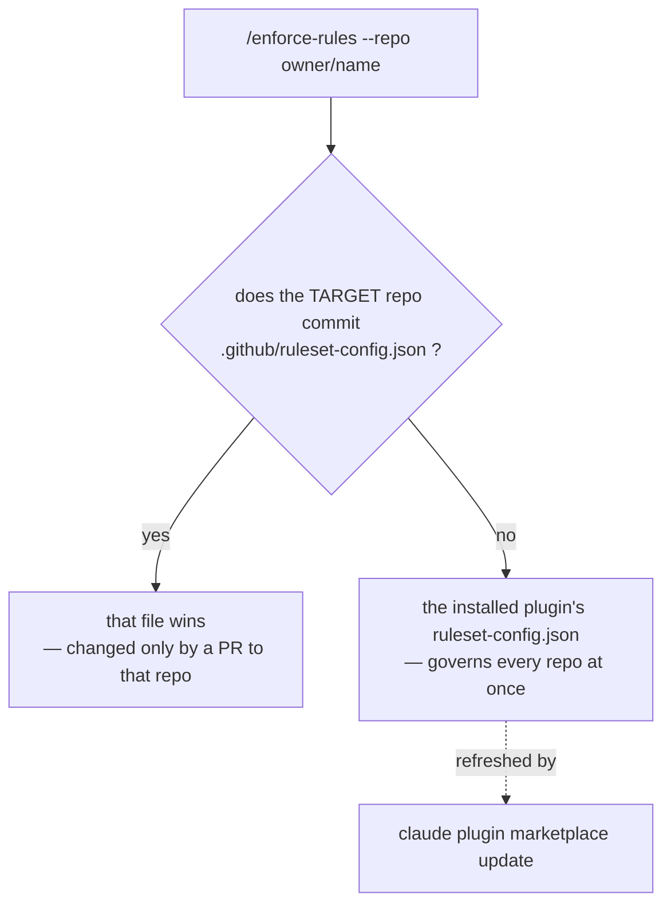

# The engineering ruleset workflow

**Who this is for:** anyone joining a repository governed by `engineering-ruleset-plugin`, plus the
person setting one up for the first time.

Two things are running. **Guardrails** — GitHub rulesets that refuse pushes, branch names and merges
server-side, for everyone, whether or not they have the plugin installed. And **automation** —
generated workflows that move your ticket through its statuses as you work, and that review your
pull request before a human does.

Both are generated from one file: `ruleset-config.json`. Nothing is configured twice.

---

## Part 1 — Setting a repository up

Done once, by someone with **admin** on the repository.

### 1.1 Prerequisites

| Need | Why |
|---|---|
| `gh` CLI, authenticated | the plugin authenticates through it; run `gh auth login` |
| Admin on the target repo | rulesets are an admin-scoped API |
| Node 18+ | the CLI runs on it; no npm install, no build |
| ClickUp or Jira | the ticket is what the scope check reads and the sync moves |
| An OpenRouter API key | both AI checks call it — [openrouter.ai → Keys](https://openrouter.ai/keys) |

**Your tracker must already have the statuses the pipeline writes.** By default:

```
to do  →  in progress  →  dev  →  QA  →  done
```

If your board calls them something else, change `taskSync.environmentStatuses` in the config —
don't edit the generated workflow, it is overwritten on every sync.

A stage can accept **several names** for the same column, and `prod` accepts `done`, `complete` and
`completed` out of the box. The sync writes the first one your board actually has, and recognises
all of them when deciding whether a card has already moved past a stage. If none of them exist, the
job says which names it tried.

### 1.2 Run the plan

```
/enforce-rules --repo owner/name
```

The plan **writes nothing**. Read it before applying — it lists every ruleset it would create, every
rule it had to weaken for this repository, and every existing ruleset it will leave alone.

On a repository with no rulesets yet you'll be asked two things:

1. **Which task tracker** — ClickUp (default), Jira, or none.
2. **Which environments** — starts at `dev` alone; `test` and `prod` are added on request and
   arrive with their own policy attached.

### 1.3 Set the credentials

The plugin never sees a token. On your own terminal it hands off to `gh`, which prompts with hidden
input and uploads the encrypted value directly.

Every value below can be generated from the link in its row — no hunting through a settings tree.

#### If you use ClickUp

| Value | Description | Where to get it | Example |
|---|---|---|---|
| `CLICKUP_TOKEN`<br>**secret** | Personal API token the workflow uses to read and move the task. | **<https://app.clickup.com/settings/apps>** → *API Token* → **Generate** (or *Regenerate*), then copy it. | `pk_12345678_ABCDEFGH…` |
| `CLICKUP_TEAM_ID`<br>**secret**, optional | Workspace id. Only needed if your workspace uses **Custom Task IDs** — it switches the sync to the custom-id endpoint. | Open any page in the workspace; it is the number in the URL: `app.clickup.com/`**`9013554321`**`/home`. | `9013554321` |

#### If you use Jira

| Value | Description | Where to get it | Example |
|---|---|---|---|
| `JIRA_API_TOKEN`<br>**secret** | Authentication token generated from your Atlassian account. | **<https://id.atlassian.com/manage-profile/security/api-tokens>** → *Create API token* → give it a label → copy the value. | `ATATT3xFfGF0…` |
| `JIRA_BASE_URL`<br>*variable* | Root web address of your Jira Cloud site. | Look at the browser bar on any Jira page. Keep only the origin — drop any path or trailing slash after `.net`. | `https://your-company.atlassian.net` |
| `JIRA_EMAIL`<br>*variable* | Email of the Atlassian account that created the token. | **<https://id.atlassian.com/manage-profile/profile-and-visibility>**, or your profile avatar → *Profile*. | `you@example.com` |

#### Either way

| Value | Description | Where to get it | Example |
|---|---|---|---|
| `OPENROUTER_API_KEY`<br>**secret** | Key the scope check and PR-Agent both use to call the model. | **<https://openrouter.ai/keys>** → *Create Key* → name it → copy it once (it is not shown again). | `sk-or-v1-…` |

`JIRA_BASE_URL` and `JIRA_EMAIL` are **variables**, not secrets — they aren't sensitive, so they're
typed in the clear:

```bash
gh secret   set OPENROUTER_API_KEY --repo owner/name   # prompts, hidden
gh variable set JIRA_BASE_URL      --repo owner/name   # typed in the clear
```

> **Never paste a token into a chat, a command line, or a file.** Anything pasted into a chat must be
> treated as exposed — revoke it and issue a new one. The hidden prompt is the only safe route.

`OPENROUTER_API_KEY` is not optional. The scope check is a **required** status check and it is
configured to block on its own errors (`failOpenOnError: false`), so a missing or invalid key means
every pull request stops. That is deliberate — a check that cannot run must not look like a check
that passed.

### 1.4 Apply

```
/enforce-rules --repo owner/name --apply
```

In order: environment branches are created, the workflow files are committed, then the rulesets go
up. That order is forced — a ruleset requiring a pull request for `dev` also refuses the push that
*creates* `dev`. On a repo that has already been synced, the blocking rulesets are switched off for
the few seconds this takes and switched back on afterwards. The plan says so before it happens.

**After applying, `main` requires a pull request — for everyone, including the repo owner.** There
are no bypass actors.

---

## Part 2 — What now exists

### The guardrails

| Ruleset | Covers | Refuses |
|---|---|---|
| `Pull Request Compulsion` | `main` + every environment | direct pushes, deletion, force-push. A PR is required (0 approvals) |
| `PR-SCOPE-CHECK` | every environment | merging until the `scope-check` status passes |
| `TRIVY-SECURITY` | every environment | merging until the `trivy-security` scan passes |
| `team-only-reviewer` | `prod` (when added) | merging without 1 approval from the reviewer team, or a code owner |
| `Enforce Branch Nomenclature` | everything else | **creating** a branch not shaped `<prefix>/<task-id>/<description>` |

### The automation

| File | Fires when | Does |
|---|---|---|
| `.github/workflows/clickup-sync.yml`<br>(or `jira-sync.yml`) | you push a work branch; a PR merges into an environment | moves the ticket forward |
| `.github/workflows/pr-scope-check.yml` | a PR targets any environment | asks an AI whether the diff matches the ticket |
| `.github/scripts/scope-check.mjs` | — | the logic that workflow runs |
| `.github/workflows/pr-agent.yml` | a PR opens, or you comment `/review` | description, review, inline suggestions, security gate |
| `.github/workflows/trivy-security.yml` | a PR targets any environment | scans for vulnerable dependencies, hardcoded secrets and IaC misconfigurations |
| `.github/scripts/trivy-report.mjs` | — | applies the threshold and posts the verdict |
| `.github/workflows/strix-pentest.yml` | **you start it from the Actions tab** | runs Strix, an AI pentesting agent; uploads findings as an artifact |

These files are **regenerated on every sync**. Edit the config, not the workflow.

---

## Part 3 — The developer loop

### Step 1 · Take a ticket and copy its id

```
ClickUp   86d3bzhgq        (short alphanumeric)
Jira      PROJ-123
```

### Step 2 · Create the branch

```bash
git switch -c feature/86d3bzhgq/checkout-redirect
```

The shape is **`<prefix>/<task-id>/<description>`**, and all three segments are required.

| Branch | |
|---|---|
| `feature/86d3bzhgq/checkout-redirect` | ✅ |
| `bugfix/PROJ-123/null-on-empty-cart` | ✅ |
| `feature/86d3bzhgq/fix/retry-logic` | ✅ — the description may contain slashes |
| `feature/86d3bzhgq` | ❌ no description |
| `feature/checkout-redirect` | ❌ only two segments |
| `wip/86d3bzhgq/thing` | ❌ `wip` is not an allowed prefix |

Allowed prefixes: `feature`, `bugfix`, `hotfix`, `docs`, `chore`.

A refused branch fails at **creation**, when you first push it:

```
! [remote rejected] ... (push declined due to repository rule violations)
```

Rename it and push again — nothing is lost:

```bash
git branch -m feature/86d3bzhgq/checkout-redirect
```

> **What the rule can and cannot check.** A GitHub ref pattern can enforce the *shape* — three
> segments, known prefix — but it cannot tell a real ticket id from any other word. That check
> happens at pull-request time, where the tracker can actually be asked. The two together are the
> guarantee.

### Step 3 · Push — the card moves to *In Progress*

```bash
git push -u origin feature/86d3bzhgq/checkout-redirect
```

That push alone moves the ticket out of to-do. No merge, no pull request, no dragging a card.

Every subsequent push runs the job too, but nothing happens — the pipeline only ever moves forward,
so a ticket already at *in progress* (or past it) is left exactly where it is.

Recognised to-do spellings: `to do`, `todo`, `open`, `backlog`, `pending`.

### Step 4 · Open a pull request into `dev`

```bash
gh pr create --base dev --title "Checkout redirect" --body "https://app.clickup.com/t/86d3bzhgq"
```

**Base is `dev`.** Head is your feature branch.

The ticket link in the body is the most reliable way for the scope check to find the ticket; the
branch name works too, and so does an id in the title.

### Step 5 · The checks run

Two workflows start automatically.

**PR-Agent** writes a summary, posts a review with file and line references, and leaves inline
suggestions. It also labels the PR when it finds a security concern — and a second job reads that
label and **fails the check**, blocking the merge until it's resolved. Trigger it again by commenting
`/review`, `/describe`, or `/improve`.

**The scope check** reads the ticket, compares it against your diff, and posts one verdict comment:

| Verdict | Result |
|---|---|
| in scope | ✅ check passes, merge unblocked |
| out of scope | 🚫 check fails **and the PR is closed automatically** |
| no ticket found | 🚫 check fails — link the ticket and push again |
| the check itself errored | 🚫 check fails — it will not pass on an error |

**Trivy** scans for vulnerable dependencies, hardcoded secrets and IaC misconfigurations, and posts
one verdict comment. It needs no credentials. What blocks you is a **severity threshold**, applied
only to the files your pull request touched:

```
CRITICAL secret in a file you changed  → 🚫 blocked
CRITICAL CVE your PR introduced        → 🚫 blocked
CRITICAL CVE with no released fix      → ⚠ reported — nothing you could do would clear it
HIGH misconfiguration                  → ⚠ reported
a finding in a file you did not touch   → ⚠ reported
```

A blocked PR gets a table naming each finding — severity, file and line, identifier, and the fix —
plus `::error` annotations on the offending lines. Fix them, or take those files out of the pull
request, and push again.

> **Out of scope closes your pull request.** This is the behaviour most worth knowing before it
> happens to you. Either strip the unrelated changes into their own branch and ticket, or widen the
> ticket's description to cover the work — then open a new PR.

Incidental changes are fine — imports, types, small config, the tests that make your change work.
What gets flagged is a genuinely unrelated edit riding along: a drive-by refactor, an unrelated
dependency bump, a fix for something the ticket never mentions.

### Step 6 · Merge — the card moves to *dev*

No approval is needed for `dev`; the pull request itself is the requirement.

### Step 7 · Promote to `test` — the card moves to *QA*

> ⚠️ **Merge your feature branch into `test`. Do not merge `dev` into `test`.**
>
> The ticket id is read from the *head branch name* of the merged pull request. `dev` carries no
> task id, so a `dev → test` promotion moves no card at all — the job logs
> `No task id in 'dev'; nothing to sync` and exits cleanly. It looks like success and does nothing.

```bash
gh pr create --base test --head feature/86d3bzhgq/checkout-redirect
```

The scope check runs here too — every environment is covered.

### Step 8 · Promote to `prod` — the card moves to *done*

Same again, base `prod`. If `prod` is configured, this one needs **1 approval** from the reviewer
team (or a code owner) on top of the scope check.

### The whole loop



Each stage has a rank, and a ticket only ever moves to a **higher** one. Merging an old branch into
`dev` can never pull a finished ticket back, and a status nobody declared — `blocked`, say — is left
alone rather than guessed at.

---

## Part 4 — When something blocks you

| What you see | What it means | Fix |
|---|---|---|
| `push declined due to repository rule violations` on a new branch | the name isn't `<prefix>/<task-id>/<description>` | `git branch -m` to a valid name, push again |
| Scope check: *no ticket linked* | nothing in the branch, title or body resolved to a ticket | paste the ticket URL in the PR body, push again |
| Scope check failed, **PR closed** | the AI judged part of the diff unrelated to the ticket | split the unrelated work out, or widen the ticket, then open a new PR |
| Scope check: *couldn't complete* | usually `OPENROUTER_API_KEY` missing, invalid, or out of credit | an admin re-sets the secret; it blocks by design until then |
| 🚫 Security gate failed | PR-Agent flagged a security concern | read its review comment, fix, push — the check re-runs |
| Trivy check failed | a `CRITICAL` finding in a file this PR changed | the comment names the file, line and fix; resolve it, or move that file out of this PR |
| Trivy flagged a CVE with no fix | upstream has published no patched version | it is reported, not blocking — if it *is* blocking, someone set `ignoreUnfixed: false` |
| Merge button greyed out on `prod` | 1 approval from the reviewer team is outstanding | request review from the team or a code owner |
| Card didn't move on merge | head branch carried no id (promoting `dev → test`), or the status name doesn't exist in the tracker | merge the feature branch itself; check `environmentStatuses` against your board |
| Card didn't move on push | branch prefix isn't in `allowedPrefixes`, or the tracker token is missing | check the workflow run log — it says which |
| `⚠ THIS RULESET IS BLOCKING MERGES` | a leftover ruleset the config no longer manages demands a review this repo can't supply | delete or edit it in **Settings → Rules** |

### Two that catch admins

**"Apply … in that file via a pull request, then re-run."**
The repository commits its own `.github/ruleset-config.json`, and that file **wins** over the
plugin's. Policy for that repo can then only change by a pull request to that repo. If you'd rather
govern it centrally, delete the override and the plugin's config takes over again.

**Plugin changes that don't take effect.**
`/enforce-rules` runs the **installed** copy of the plugin, not your working tree:

```
~/.claude/plugins/marketplaces/<marketplace>/
```

Editing `ruleset-config.json` in a checkout on your Desktop changes nothing until the change reaches
the plugin repo's default branch and the install is refreshed:

```bash
claude plugin marketplace update
```

This is the single most common reason a policy change "didn't apply".

---

## Part 5 — Where policy comes from



Pick one deliberately:

| | Central (no override) | Per-repo (committed override) |
|---|---|---|
| Change policy | edit the plugin, refresh, re-sync | a PR to that repository |
| `--env` from the CLI | works | refused |
| Rolls out to | every repo at once | that repo only |

---

## Part 6 — Admin operations

**Add an environment.** One line in `environments`, or:

```
/enforce-rules --repo owner/name --env staging --apply
```

It joins the PR requirement, gets the scope check, is excluded from the branch-naming rule, and
becomes a task-sync stage — all from the same list. Declaration **order is the pipeline order**, so
an environment added later lands last; reorder `environments` if that's wrong for your real pipeline.

An environment with no entry in `environmentStatuses` maps to a status of its own name.

**Switch tracker.** `--provider jira` rewrites the sync workflow and plans a `DELETE` of the other
provider's — leaving it would have both trackers moving tickets on every merge.

**Turn a check off.** Set `prChecks.scopeCheck.enabled` or `prAgent.enabled` to `false`; the next
sync removes the file — but only if the plugin wrote it. A hand-written workflow at the same path is
never deleted.

**Loosen the branch shape.** `requireDescription: false` permits the bare `<prefix>/<task-id>` form
again. Setting `taskIdPrefix` (e.g. `"CU-"`) narrows the id segment to that marker.

---

## Quick reference

```bash
# start work
git switch -c feature/86d3bzhgq/checkout-redirect
git push -u origin feature/86d3bzhgq/checkout-redirect   # → card: in progress

# ship it
gh pr create --base dev  --head feature/86d3bzhgq/checkout-redirect   # → merge → card: dev
gh pr create --base test --head feature/86d3bzhgq/checkout-redirect   # → merge → card: QA
gh pr create --base prod --head feature/86d3bzhgq/checkout-redirect   # → merge → card: done
```

| Rule | Value |
|---|---|
| Branch shape | `<prefix>/<task-id>/<description>` |
| Prefixes | `feature` `bugfix` `hotfix` `docs` `chore` |
| Card moves on | push, and every merge into an environment |
| Direction | forwards only, never backwards |
| Promotion | merge the **feature branch** into each environment |
| Out of scope | closes the pull request |
| Trivy | `CRITICAL` in a file you changed blocks; everything else reports |
| `prod` | 1 approval from the reviewer team |
